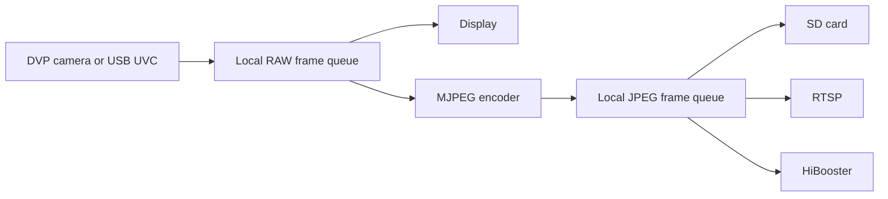
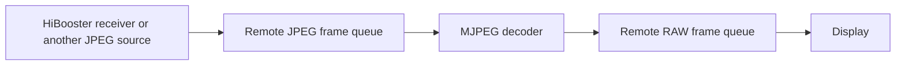
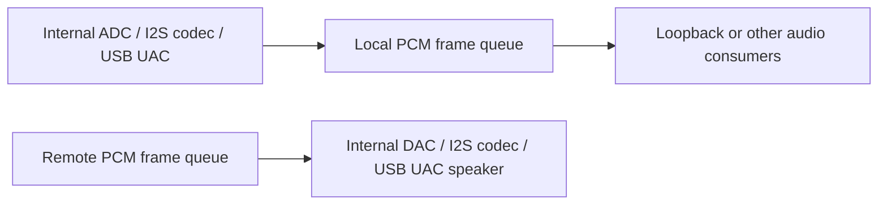

# Solution Utils

English | [简体中文](README_zh.md)

Solution Utils is a collection of reusable utilities for embedded audio, video, frame-buffer, storage, networking, USB, and display pipelines in Bouffalo SDK solutions.

The component is organized as small functional modules. Enable only the modules required by an application through Kconfig and include the corresponding public headers from the module directory.

## Frame queues

The central data path is FBQ (Frame Buffer Queue), a reference-counted,
zero-copy publish/subscribe queue. Producers publish an `fbq_elem_t` descriptor,
and one payload can be routed to several independent consumers without being
copied. Solution Utils provides the following configurable queue instances:

- **Local RAW video** — frames captured locally by DVP or USB UVC;
- **Remote RAW video** — frames produced by decoding received JPEG data;
- **Local JPEG video** — frames encoded or captured locally;
- **Remote JPEG video** — frames received from a network source;
- **Local PCM audio** — audio captured from a local input device;
- **Remote PCM audio** — audio prepared for playback or recording.

The core FBQ API, ownership rules, reference counting, output subscriptions and
configuration are documented separately under
`components/soln_utils/fb_queue/`. Start with the [FBQ User Guide](fb_queue/README.md) for the user
guide. The main public headers are `fb_queue/fbq_core.h` and `fb_queue/soln_fbq.h`.

## Modules

### `fb_queue/` — Frame Buffer Queue core

Provides the common frame descriptor pool and multi-consumer routing layer used
by the other modules. It owns the local/remote RAW, JPEG and PCM queue instances
enabled through Kconfig. This is infrastructure rather than a media producer or
consumer: producers allocate and publish elements, while consumers open an
output subscription, pop elements and release their references after use.

### `audio/` — Audio capture, playback and loopback

Connects audio peripherals to the PCM queues:

- internal AUADC and external-codec I2S input **produce local PCM** frames;
- the loopback task **consumes local PCM** and **produces remote PCM** frames;
- internal AUDAC and external-codec I2S output **consume remote PCM** frames;
- the ES8388 helper initializes and controls the external codec and does not
        produce or consume queue elements by itself.

The enabled input and output paths require the corresponding local or remote PCM
queue. Peripheral implementations additionally depend on the relevant audio,
I2S and DMA drivers.

### `display/` — DBI and RGB display output

Provides MCU DBI and RGB-panel display tasks, display flushing, and drawing
helpers. A display is a **RAW video consumer**: it consumes the remote RAW queue
when that pipeline is enabled, otherwise it can consume the local RAW queue.
It does not produce another media queue. The module depends on the BSP LCD
configuration and the selected display driver.

### `dvp/` — DVP camera capture

Captures frames from a DVP image sensor and **produces local RAW video** frames,
including pixel-format and image-region metadata. Downstream consumers normally
include the display module and the standard MJPEG encoder. It requires the local
RAW queue, BSP image-sensor support, camera hardware and DMA resources.

### `mjpeg_enc/` — MJPEG encoding

Contains two local JPEG production paths:

- the standard encoder **consumes local RAW video** and **produces local JPEG**
        frames;
- the DVP line-buffer encoder receives camera data directly and **produces local
        JPEG** frames without first publishing a complete local RAW frame.

Produced JPEG frames may be consumed independently by SD recording, RTSP or
HiBooster. The module depends on the hardware JPEG encoder and the queue set
required by the selected path.

### `mjpeg_dec/` — MJPEG decoding

Implements the remote video decode path. It **consumes remote JPEG video** frames,
decodes them with the hardware JPEG decoder, and **produces remote RAW video**
frames in the configured output pixel format. The remote RAW output can then be
consumed by a display or another application subscriber.

### `usbh_uvc_uac/` — USB camera and audio streaming

Adapts CherryUSB host video and audio streams to Solution Utils:

- UVC YUYV capture **produces local RAW video** frames;
- UVC MJPEG capture **produces local JPEG video** frames;
- UAC microphone capture **produces local PCM audio** frames;
- the UAC speaker path is the playback-side integration point for **remote PCM
        audio consumption**.

Only the queues required by the selected UVC/UAC modes need to be enabled. The
module also depends on CherryUSB host, the appropriate UVC/UAC class support,
the USB host controller and platform cache/DMA integration.

### `hibooster/` — JPEG network transport

Bridges the JPEG queues and the HiBooster network protocol:

- the sender **consumes local JPEG video** frames and transmits them through
        lwIP;
- the receiver reconstructs network frames and **produces remote JPEG video**
        frames.

This module depends on lwIP and on the local or remote JPEG queue selected by
the enabled direction. The receiver output is commonly connected to MJPEG
decoding or SD recording.

### `rtsp/` — RTSP video streaming

Publishes locally generated MJPEG video through the SDK RTSP service. It is a
network **consumer of the local JPEG queue** and does not produce another FBQ
stream. It depends on lwIP, the SDK RTSP component and a local JPEG producer such
as the MJPEG encoder or a UVC MJPEG camera.

### `sd_card/` — JPEG and AVI recording

Provides FatFs/SD-card setup plus JPEG and AVI recording helpers. Video
recording **consumes either the local or remote JPEG queue**, selected by the
enabled pipeline. AVI audio recording additionally **consumes the remote PCM
queue**. The module writes files rather than producing another media queue and
depends on FatFs, the SDH SD-card driver and BSP SD-card support.

### Root orchestration — initialization and statistics

`soln_solution.c` initializes all configured queue instances and starts the
enabled audio, video, display, codec and storage tasks in the required order.
It also collects and optionally prints pipeline FPS statistics. Applications can
use `soln_init()` as the common Solution Utils startup entry point.

## Typical data paths

### Local video capture

### Remote video playback

### Audio

## Configuration

The component configuration is provided through Kconfig. The main options are grouped into:

- audio functions;
- video capture, display, encoding, and decoding;
- SD-card recording and network streaming;
- frame-buffer queue instances and stream routing;
- module-specific log levels.

Most functional modules depend on a corresponding frame-buffer queue and on the required SDK peripheral, filesystem, network, or CherryUSB component. Kconfig dependency checks prevent incompatible combinations from being enabled together.

## Public headers

Start with these headers when integrating the component:

- `fb_queue/fbq_core.h` — generic frame-buffer queue API;
- `fb_queue/soln_fbq.h` — Solution Utils queue instances, frame types, and stream accessors;
- `audio/*.h` — audio adapters and codec helpers;
- `display/*/*.h` — display consumers and drawing helpers;
- `dvp/soln_dvp.h` — DVP capture interface;
- `mjpeg_enc/*.h` and `mjpeg_dec/soln_mjpeg_dec.h` — JPEG codec interfaces;
- `usbh_uvc_uac/inc/*.h` — USB video/audio stream interfaces;
- `hibooster/inc/*.h` — HiBooster sender and receiver interfaces;
- `rtsp/include/soln_bl_cam_rtsp.h` — RTSP stream control;
- `sd_card/*.h` — JPEG and AVI recording interfaces.

## Integration notes

- Configure the required queue instances before enabling their producers or consumers.
- Ensure that frame ownership and release rules are followed when using reference-counted queues.
- Match video pixel formats, frame sizes, and buffer capacities across capture, codec, display, and storage modules.
- Enable the required BSP, filesystem, network, and USB host components before enabling dependent Solution Utils features.
