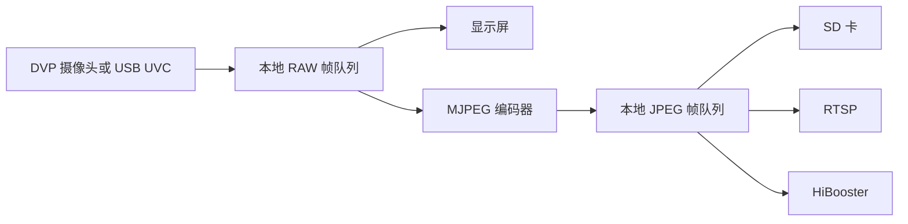
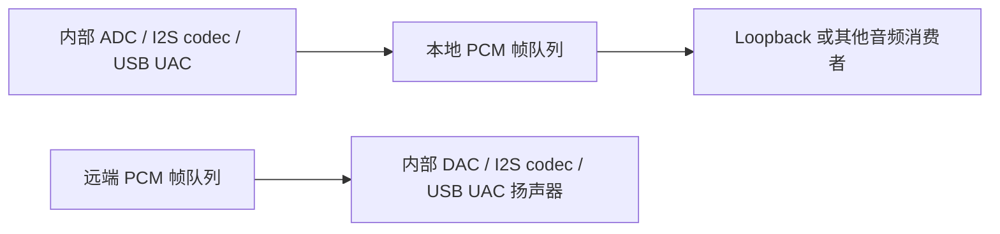

# Solution Utils

[English](README.md) | 简体中文

Solution Utils 是 Bouffalo SDK Solution 中的一组可复用工具模块，覆盖嵌入式音频、视频、帧缓存、存储、网络、USB 和显示处理流程。

组件按照功能拆分为多个小模块。应用可以通过 Kconfig 只启用实际需要的功能，并包含对应模块目录中的公共头文件。

## 帧队列

组件的核心数据通路是 FBQ（Frame Buffer Queue），即带引用计数的零拷贝发布订阅队列。生产者发布一个 `fbq_elem_t` 描述符，同一份 payload 可以在不复制数据的情况下路由给多个相互独立的消费者。Solution Utils 提供以下可配置队列实例：

- **本地 RAW 视频队列**：承载 DVP、USB UVC 等本地采集源产生的 RAW 帧；
- **远端 RAW 视频队列**：承载远端 JPEG 数据解码后产生的 RAW 帧；
- **本地 JPEG 视频队列**：承载本地编码或采集得到的 JPEG 帧；
- **远端 JPEG 视频队列**：承载从网络接收到的 JPEG 帧；
- **本地 PCM 音频队列**：承载本地输入设备采集的 PCM 音频；
- **远端 PCM 音频队列**：承载等待播放或录制的 PCM 音频。

FBQ 的核心 API、所有权规则、引用计数、输出订阅和配置方法在 `components/soln_utils/fb_queue/` 下有独立文档。建议先阅读 [FBQ 用户指南](fb_queue/README_zh.md)。主要公共头文件为 `fb_queue/fbq_core.h` 和 `fb_queue/soln_fbq.h`。

## 模块说明

### `fb_queue/` —— 帧缓存队列核心

提供其他模块共用的帧描述符池和多消费者路由层，并管理通过 Kconfig 启用的本地/远端 RAW、JPEG 和 PCM 队列实例。它属于基础设施，本身不直接生产或消费媒体数据：生产者负责申请并发布元素，消费者负责打开输出订阅、取出元素，并在使用完成后释放引用。

### `audio/` —— 音频采集、播放与回环

负责将音频外设接入 PCM 队列：

- 内部 AUADC 和外部 codec I2S 输入**生产本地 PCM** 帧；
- loopback 任务**消费本地 PCM**，并**生产远端 PCM** 帧；
- 内部 AUDAC 和外部 codec I2S 输出**消费远端 PCM** 帧；
- ES8388 辅助代码负责外部 codec 的初始化和控制，本身不生产或消费队列元素。

启用输入或输出功能时，需要同时启用对应的本地或远端 PCM 队列。具体外设实现还依赖相应的音频、I2S 和 DMA 驱动。

### `display/` —— DBI 与 RGB 显示输出

提供 MCU DBI 和 RGB 显示任务，以及显示刷新和绘图辅助功能。显示模块是 **RAW 视频消费者**：远端 RAW 流程启用时优先消费远端 RAW 队列，否则可以消费本地 RAW 队列。该模块不会继续生产其他媒体队列，依赖 BSP LCD 配置和对应显示驱动。

### `dvp/` —— DVP 摄像头采集

从 DVP 图像传感器采集图像，并**生产本地 RAW 视频**帧，同时填写像素格式和图像区域等元数据。常见下游消费者是显示模块和标准 MJPEG 编码器。该模块依赖本地 RAW 队列、BSP 图像传感器支持、摄像头硬件和 DMA 资源。

### `mjpeg_enc/` —— MJPEG 编码

提供两种本地 JPEG 生产流程：

- 标准编码器**消费本地 RAW 视频**，并**生产本地 JPEG** 帧；
- DVP line-buffer 编码器直接接收摄像头数据并**生产本地 JPEG** 帧，不需要先发布完整的本地 RAW 帧。

产生的 JPEG 帧可以由 SD 卡录制、RTSP 或 HiBooster 独立消费。模块依赖硬件 JPEG 编码器，以及所选流程对应的队列实例。

### `mjpeg_dec/` —— MJPEG 解码

实现远端视频解码流程。模块**消费远端 JPEG 视频**帧，通过硬件 JPEG 解码器转换为配置的输出像素格式，再**生产远端 RAW 视频**帧。远端 RAW 输出通常交给显示模块，也可以由应用自行订阅处理。

### `usbh_uvc_uac/` —— USB 摄像头与音频流

将 CherryUSB Host 的视频和音频流接入 Solution Utils：

- UVC YUYV 采集**生产本地 RAW 视频**帧；
- UVC MJPEG 采集**生产本地 JPEG 视频**帧；
- UAC 麦克风采集**生产本地 PCM 音频**帧；
- UAC 扬声器流程是**消费远端 PCM 音频**的播放侧接入点。

只需要启用所选 UVC/UAC 模式对应的队列。模块还依赖 CherryUSB Host、相应的 UVC/UAC class、USB Host 控制器，以及平台 cache 和 DMA 适配。

### `hibooster/` —— JPEG 网络传输

在 JPEG 队列和 HiBooster 网络协议之间建立桥接：

- 发送端**消费本地 JPEG 视频**帧，并通过 lwIP 发送；
- 接收端重组网络帧，并**生产远端 JPEG 视频**帧。

模块依赖 lwIP，以及发送或接收方向对应的本地/远端 JPEG 队列。接收端输出通常交给 MJPEG 解码器或 SD 卡录制模块。

### `rtsp/` —— RTSP 视频推流

通过 SDK RTSP 服务对外提供本地产生的 MJPEG 视频。该模块是本地 JPEG 队列的网络**消费者**，不会再生产其他 FBQ 数据流。它依赖 lwIP、SDK RTSP 组件，以及 MJPEG 编码器或 UVC MJPEG 摄像头等本地 JPEG 生产者。

### `sd_card/` —— JPEG 与 AVI 录制

提供 FatFs/SD 卡初始化、JPEG 文件和 AVI 文件录制辅助功能。视频录制根据启用的流程**消费本地或远端 JPEG 队列**；AVI 音频录制还会**消费远端 PCM 队列**。该模块的输出是存储文件，不会生产新的媒体队列，并依赖 FatFs、SDH SD 卡驱动和 BSP SD 卡支持。

### 根目录调度模块 —— 初始化与统计

`soln_solution.c` 按照正确顺序初始化所有已配置队列，并启动启用的音频、视频、显示、编解码和存储任务；同时负责收集和按配置打印各处理环节的 FPS 统计。应用可以使用 `soln_init()` 作为 Solution Utils 的统一启动入口。

## 典型数据流

### 本地视频采集

### 远端视频播放

### 音频处理

## 配置方式

组件通过 Kconfig 提供配置，主要分为以下几组：

- 音频功能；
- 视频采集、显示、编码和解码；
- SD 卡录制和网络传输；
- 帧缓存队列实例及数据流路由；
- 各模块独立的日志等级。

大多数功能模块依赖对应的帧缓存队列，以及所需的 SDK 外设、文件系统、网络或 CherryUSB 组件。Kconfig 会检查模块间的依赖关系，避免启用互相不兼容的组合。

## 公共头文件

集成组件时可以优先查看以下头文件：

- `fb_queue/fbq_core.h`：通用帧缓存队列 API；
- `fb_queue/soln_fbq.h`：Solution Utils 队列实例、帧类型和数据流访问接口；
- `audio/*.h`：音频适配器和 codec 辅助接口；
- `display/*/*.h`：显示消费者和绘图辅助接口；
- `dvp/soln_dvp.h`：DVP 采集接口；
- `mjpeg_enc/*.h` 和 `mjpeg_dec/soln_mjpeg_dec.h`：JPEG 编解码接口；
- `usbh_uvc_uac/inc/*.h`：USB 视频和音频流接口；
- `hibooster/inc/*.h`：HiBooster 发送和接收接口；
- `rtsp/include/soln_bl_cam_rtsp.h`：RTSP 流控制接口；
- `sd_card/*.h`：JPEG 和 AVI 录制接口。

## 集成注意事项

- 启用视频或音频生产者、消费者之前，先配置对应的帧缓存队列实例。
- 使用引用计数队列时，必须遵循帧所有权和释放规则。
- 采集、编解码、显示和存储模块之间的视频像素格式、帧尺寸和 buffer 容量必须匹配。
- 启用依赖的 Solution Utils 功能前，应先启用对应的 BSP、文件系统、网络和 USB Host 组件。
