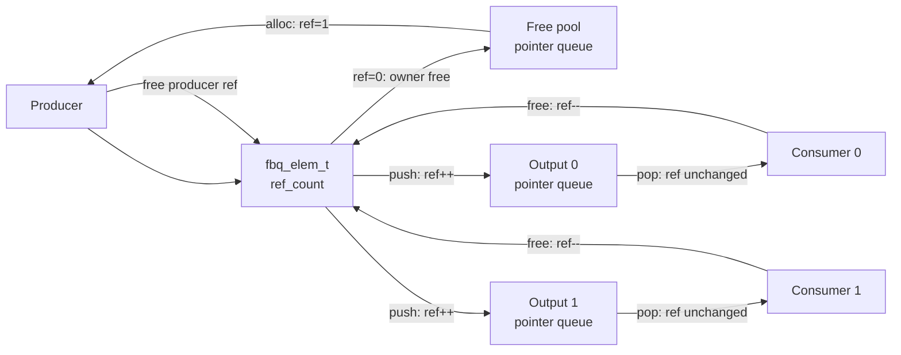

# FBQ User Guide

English | [简体中文](README_zh.md)

FBQ (Frame Buffer Queue) is a reference-counted, zero-copy queue for video frames, audio frames, and other frame buffers. A FreeRTOS queue carries only `fbq_elem_t *` pointers, so publishing one frame to multiple consumers does not copy its descriptor or payload.

The public API is declared in `fbq_core.h`.

## 1. Core Objects

| Type | Description |
|---|---|
| `fbq_ctrl_t` | Element owner, fixed pool, and multi-output router |
| `fbq_elem_t` | Stable descriptor for one frame; `data` points to its payload |
| `fbq_config_t` | Initialization configuration for the default fixed pool |
| `fbq_elem_ops_t` | Element allocation and final-release operations for a custom owner |
| `fbq_ops_t` | Backend operations for push, pop, and output management |
| `fbq_output_t` | One consumer output subscription |

The default controller manages descriptor storage and FreeRTOS queues internally. The payload may use fixed storage supplied by the caller, or the producer may bind an external buffer after each element allocation.

`fbq_elem_t.type_mask` describes the data categories to which the current frame belongs. An output's `accept_mask` describes the categories accepted by that subscriber. A frame enters an output queue only when the bitwise AND of these masks is nonzero. `ext_type` and `ext_size` only describe how to interpret the extension area; they do not participate in subscription filtering.

## 2. Processing Model

A producer obtains the initial reference from the free pool. Before publishing, `push` checks the frame's `type_mask` against the output's `accept_mask`. Each matching, successful enqueue retains one reference for that output. `pop` transfers the output reference to the consumer without changing the reference count. Every holder calls `fbq_free()` after use; the owner reclaims the element when the final reference is released.

## 3. API Reference

### Initialization and Deinitialization

#### `fbq_init()`

Initializes the default fixed pool and multi-output router:

- Allocates descriptor storage according to `elem_count` and `elem_stride`;
- Creates the FreeRTOS queue that stores free `fbq_elem_t *` pointers;
- Configures the default `type_mask`, optional fixed payload storage, extension area, cleanup callback, and user context;
- May only be called from task context.

When `elem_stride` is zero, it is calculated automatically from `ext_size`. `default_type_mask == 0` means that elements initially belong to no data category. When `data_storage` is `NULL`, FBQ creates a descriptor-only pool; the producer must assign `data` and `capacity` after every allocation.

#### `fbq_deinit()`

Destroys a default controller and releases its internal descriptor storage. All outputs must be closed and all elements returned first. It returns `FBQ_ERR_BUSY` if an output remains open or an element is still in flight.

#### `fbq_owner_init()`

Initializes an external element owner for DMA buffers, driver buffers, network buffers, dynamically allocated wrappers, or similar external objects.

An external owner must provide a final `free` operation; `alloc` is optional. This function initializes only the owner and does not automatically provide output routing.

#### `fbq_elem_init()`

Initializes a persistent external element wrapper, sets `type_mask`, `ext_type`, and `ext_size`, and establishes one initial producer reference. The wrapper must remain valid throughout its asynchronous lifetime and therefore must not be a stack object that goes out of scope.

### Data Path

#### `fbq_alloc()`

Obtains an element from an owner. On success:

- `elem->owner` points to the supplied controller;
- `ref_count` is initialized to 1;
- A fixed-pool element's `type_mask` is restored to the controller's `default_type_mask`;
- The caller owns one producer reference.

In ISR context, timeout is ignored and the operation is always non-blocking.

#### `fbq_push()`

Publishes an element to one output:

- Retains one reference for the target output before enqueueing;
- Enqueues only when `(elem->type_mask & output->accept_mask) != 0`;
- Returns `FBQ_ERR_FILTERED` when the type does not match;
- On success, the output queue owns the retained reference;
- On failure, automatically rolls back the retained reference;
- Never releases the caller's existing producer reference.

When `target == NULL`, `elem->owner` is used as the target router. An external owner normally has no routing capability, so its caller must specify a target controller explicitly.

#### `fbq_push_mask()`

Publishes independently to each output selected by `output_mask` and returns the bit mask of outputs that both matched and accepted the element. Every output applies its own `accept_mask`. Filtering or enqueue failure on one output does not affect another and does not release the producer reference.

#### `fbq_pop()`

Obtains an element from an output. On success, the output queue's reference is transferred directly to the consumer, so the reference count does not change. The consumer must call `fbq_free()` after use.

#### `fbq_free()`

Releases one reference held by the caller. When the count reaches zero, FBQ calls `elem->owner->elem_ops->free()`:

- The default fixed pool returns the element to its free queue;
- An external owner returns or releases the native buffer;
- If configured, the default pool invokes `cleanup` before reclaiming the element.

The final `fbq_free()` may execute in ISR context. Therefore, cleanup callbacks and custom owner `free` operations must be non-blocking and ISR-safe; otherwise, they must defer the actual release to a task.

### Output Management

#### `fbq_output_open()`

Creates a consumer output and its FreeRTOS pointer queue, and assigns an immutable `accept_mask`. The caller may request a specific output ID or use `FBQ_OUTPUT_AUTO` to select an available slot. `accept_mask == 0` accepts no frames, while `FBQ_TYPE_MASK_ALL` accepts every frame type. This function may only be called from task context.

#### `fbq_output_close()`

Drains and deletes an output. Every element not yet popped is passed to `fbq_free()` to release that output's queue reference. Consumers remain responsible for elements already popped.

The caller must first stop and synchronize all push, pop, and count operations on that output. This function may only be called from task context.

#### `fbq_output_count()`

Returns the number of elements currently waiting on an output. The result is only a snapshot and must not be used as a concurrency synchronization condition.

#### `fbq_free_count()`

Returns the number of elements currently available from the default fixed pool. The result is only a snapshot.

### Helpers and Macros

#### `fbq_elem_extension()`

Returns the address of an element's type-specific extension area. The caller interprets this memory according to the agreed `ext_type` and `ext_size`.

#### `FBQ_ELEM_STRIDE()`

Calculates a descriptor stride with the alignment required for pointers. Normally, leave `fbq_config_t.elem_stride` at zero so that `fbq_init()` calculates it with this macro.

#### Output-selection macros

- `FBQ_OUTPUT_MAX`: maximum number of outputs supported by a controller;
- `FBQ_OUTPUT_AUTO`: request automatic output ID allocation;
- `FBQ_OUTPUT_BIT(id)`: convert an output ID to a mask bit;
- `FBQ_OUTPUT_ALL`: select all outputs.

#### Type-filtering macros

- `FBQ_TYPE_BIT(id)`: convert a frame type ID to a `type_mask` bit;
- `FBQ_TYPE_MASK_ALL`: match all frame types.

`type_mask` categorizes frame data and may contain multiple bits. `ext_type` identifies the exact structure stored in the extension area. The two fields serve different purposes and are not interchangeable.

## 4. Lifetimes

### Controller Lifetime

1. Initialize a default controller with `fbq_init()`, or an external owner with `fbq_owner_init()`;
2. Create the required outputs on a default controller with `fbq_output_open()`;
3. Run producer and consumer data paths;
4. Stop and synchronize every task, ISR, and DMA callback;
5. Close every output with `fbq_output_close()`;
6. Verify that every allocated or popped element has been released;
7. Destroy the default controller with `fbq_deinit()`.

A controller must outlive every element it owns. After deinitialization, its controller, outputs, and pool elements must no longer be accessed.

### Element Reference Lifetime

An element's references are jointly held by producers, output queues, and consumers:

1. `fbq_alloc()` or `fbq_elem_init()` establishes the initial producer reference with `ref_count = 1`;
2. Every successful `fbq_push()` establishes one queue reference for the corresponding output;
3. `fbq_pop()` transfers a queue reference to a consumer without changing the count;
4. The producer calls `fbq_free()` once after publishing is complete;
5. Every consumer that successfully popped the element calls `fbq_free()` once after use;
6. The owner performs final reclamation when the count reaches zero.

This can be expressed as:

$$
ref\_count = producer\ references + output\ queue\ references + popped\ consumer\ references
$$

Follow these rules:

- Every reference obtained by a successful allocation, external-element initialization, or pop must eventually be released exactly once;
- `fbq_push()` and `fbq_push_mask()` do not release the caller's reference;
- If a push is filtered or enqueueing fails, FBQ rolls back only its internally retained reference; the caller still owns the original reference;
- After the first publication, consumers must treat `type_mask`, shared payload, and metadata as read-only;
- Do not access an element after its reference count reaches zero; an external owner's `free` operation may invalidate it immediately.

### Output Lifetime

While an output remains open, tasks and ISRs may run data-path operations concurrently. Closing an output is a control operation that the caller must serialize against the data path:

- Do not close an output concurrently with push, pop, or count operations on that output;
- No task may remain blocked in a push or pop on that output when it is closed;
- Serialize output-control operations such as open and close;
- Do not use an output ID after its output has been closed.

## 5. ISR Constraints

`fbq_alloc()`, `fbq_push()`, `fbq_push_mask()`, `fbq_pop()`, `fbq_free()`, `fbq_output_count()`, and `fbq_free_count()` support ISR context:

- They automatically select the appropriate FreeRTOS `FromISR` API;
- Timeout is ignored in an ISR, so operations are always non-blocking;
- Reference counts are updated only inside short local interrupt-disabled critical sections;
- The current implementation does not support sharing one controller across CPU cores.

`fbq_init()`, `fbq_deinit()`, `fbq_output_open()`, and `fbq_output_close()` may only be called from task context.

## 6. Return Values

| Value | Meaning |
|---|---|
| `FBQ_OK` | Operation succeeded |
| `FBQ_ERR_INVALID` | Invalid argument or configuration |
| `FBQ_ERR_UNSUPPORTED` | The controller does not provide the requested operation |
| `FBQ_ERR_TIMEOUT` | Queue timeout or non-blocking operation failure |
| `FBQ_ERR_BUSY` | An output remains open or an element is still in use |
| `FBQ_ERR_NO_RESOURCE` | Insufficient descriptor, queue, or output-slot resources |
| `FBQ_ERR_FILTERED` | The frame's `type_mask` is not accepted by the target output |

On success, `fbq_output_count()` and `fbq_free_count()` directly return a nonnegative count. On failure, they return a negative `FBQ_ERR_*` value.

## 7. BL616 Solution Instances

`soln_fbq_init_all()` initializes six independent fixed pools according to Kconfig.

`LOCAL` and `REMOTE` describe a frame's origin, not the producer/consumer role or the direction of `fbq_output_*()` data flow. `LOCAL` means that the frame was captured, encoded, or recorded on this device. `REMOTE` means that it came from a network, storage device, or another external source and is consumed locally.

| Origin and format | Controller accessor | Example producer type | Extension area |
|---|---|---|---|
| Local RAW | `soln_fbq_vid_raw_local()` | `IMG_RAW_CAM`, `IMG_RAW_UVC` | `soln_fbq_img_raw_ext_t` |
| Remote RAW | `soln_fbq_vid_raw_remote()` | `IMG_RAW_JPEG_DEC` | `soln_fbq_img_raw_ext_t` |
| Local JPEG | `soln_fbq_vid_jpeg_local()` | `IMG_JPEG_JPEG_ENC`, `IMG_JPEG_UVC` | None |
| Remote JPEG | `soln_fbq_vid_jpeg_remote()` | `IMG_JPEG_HB_REC` | None |
| Local PCM audio | `soln_fbq_aud_pcm_local()` | `AUDIO_PCM_AUADC`, `AUDIO_PCM_I2S_IN`, `AUDIO_PCM_UAC_IN` | None |
| Remote PCM audio | `soln_fbq_aud_pcm_remote()` | `AUDIO_PCM_LOOPBACK` | None |

Solution `SOLUTION_FBQ_TYPE_*` values represent a data format plus its direct producer. Every fixed pool has a zero `default_type_mask`; the actual producer must set one precise `SOLUTION_FBQ_TYPE_MASK_*` before publishing. A consumer may combine precise masks with bitwise OR, or use an `*_ALL` aggregate mask to select multiple producers. The RAW pixel format remains in the extension area's `format` field.

Access RAW dimensions and pixel format through `soln_fbq_img_raw_ext()` or `soln_fbq_img_raw_ext_const()`. Stream IDs and default depth macros remain centrally defined in `soln_fbq.h`.

Typical producer flow:

1. Call `fbq_alloc()` on the corresponding instance;
2. Set the precise producer `type_mask`, then fill the payload, `size`, and extension metadata;
3. Publish with `fbq_push()` or `fbq_push_mask()`;
4. Regardless of how many outputs accepted the element, call `fbq_free()` once to release the initial producer reference.

Typical consumer flow:

1. Call `fbq_output_open()` with a matching `accept_mask`;
2. Obtain an `fbq_elem_t *` with `fbq_pop()`;
3. Call `fbq_free()` after asynchronous DMA, USB, network, or LVGL use has completed;
4. Stop and synchronize the data path before calling `fbq_output_close()`.
