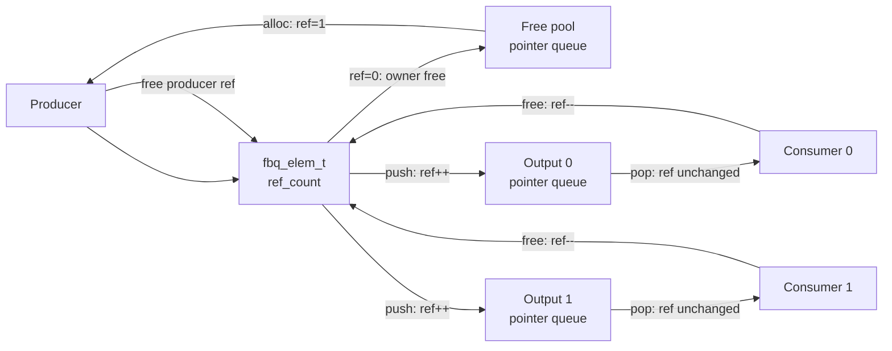

# FBQ 使用说明

[English](README.md) | 简体中文

FBQ（Frame Buffer Queue）是面向视频帧、音频帧及其他帧缓存的引用计数零拷贝队列。FreeRTOS queue 中只传递 `fbq_elem_t *`，同一帧发布到多个消费者时不复制 descriptor 和 payload。

公开接口位于 `fbq_core.h`。

## 1. 核心对象

| 类型 | 说明 |
|---|---|
| `fbq_ctrl_t` | 元素 owner、固定池和多输出路由控制器 |
| `fbq_elem_t` | 一帧数据的稳定 descriptor，`data` 指向 payload |
| `fbq_config_t` | 默认固定池的初始化配置 |
| `fbq_elem_ops_t` | 自定义 owner 的元素分配和最终释放操作 |
| `fbq_ops_t` | push、pop 和输出管理后端操作 |
| `fbq_output_t` | 一个消费者输出订阅 |

默认控制器内部管理 descriptor 存储和 FreeRTOS queue。payload 可以使用调用方提供的固定存储，也可以在每次分配元素后绑定外部 buffer。

`fbq_elem_t.type_mask` 描述当前帧所属的数据分类，output 的 `accept_mask` 描述订阅者接受的分类。只有两者按位与不为 0 时，帧才会进入该 output queue。`ext_type/ext_size` 只用于描述和解释扩展区，不参与订阅过滤。

## 2. 工作模型

生产者从空闲池获得初始引用。push 先检查帧的 `type_mask` 与订阅的 `accept_mask`，匹配且成功入队时为目标输出保留一个引用。pop 只将输出引用转移给消费者；所有持有者完成使用后调用 `fbq_free()`，最后一个引用释放时由 owner 回收元素。

## 3. API 说明

### 初始化与销毁

#### `fbq_init()`

初始化默认固定池和多输出路由器：

- 根据 `elem_count` 和 `elem_stride` 自动分配 descriptor 存储；
- 创建保存空闲 `fbq_elem_t *` 的 FreeRTOS queue；
- 配置默认 `type_mask`、可选固定 payload 存储、扩展区、cleanup 和用户上下文；
- 只能在 task 上下文调用。

`elem_stride` 为 0 时按 `ext_size` 自动计算。`default_type_mask == 0` 表示元素默认不属于任何类型。`data_storage` 为 `NULL` 时建立 descriptor-only 池，生产者应在每次分配后填写 `data` 和 `capacity`。

#### `fbq_deinit()`

销毁默认控制器并释放内部 descriptor 存储。调用前必须关闭全部输出，并保证所有元素已经归还。仍有输出或在途元素时返回 `FBQ_ERR_BUSY`。

#### `fbq_owner_init()`

初始化外部元素 owner。用于管理 DMA buffer、驱动 buffer、网络 buffer 或动态 wrapper 等外部对象。

外部 owner 必须提供最终 `free` 操作；`alloc` 可选。该接口只初始化 owner，不自动提供输出路由能力。

#### `fbq_elem_init()`

初始化一个持久化外部元素 wrapper，设置 `type_mask/ext_type/ext_size`，并建立一个初始生产者引用。wrapper 的存储必须覆盖完整异步生命周期，不能使用离开作用域后失效的栈变量。

### 数据路径

#### `fbq_alloc()`

从 owner 获取一个元素。成功后：

- `elem->owner` 指向传入的控制器；
- `ref_count` 初始化为 1；
- 固定池元素的 `type_mask` 恢复为控制器的 `default_type_mask`；
- 调用者持有一个生产者引用。

在 ISR 中 timeout 被忽略，操作始终非阻塞。

#### `fbq_push()`

将元素发布到一个输出：

- 入队前为目标输出增加一个引用；
- 仅当 `(elem->type_mask & output->accept_mask) != 0` 时允许入队；
- 类型不匹配时返回 `FBQ_ERR_FILTERED`；
- 成功后该引用由输出 queue 持有；
- 失败时自动回滚预留引用；
- 不会释放调用者原有的生产者引用。

`target == NULL` 时使用 `elem->owner` 作为目标路由器。外部 owner 通常没有路由能力，此时必须显式指定目标控制器。

#### `fbq_push_mask()`

向 `output_mask` 选中的多个输出独立发布，返回实际匹配且成功入队的 output bit mask。每个 output 使用自己的 `accept_mask` 过滤；某个输出被过滤或入队失败不会影响其他输出，也不会释放生产者引用。

#### `fbq_pop()`

从指定输出获取一个元素。成功时，输出 queue 持有的引用直接转移给消费者，因此引用计数不变。消费者使用完成后必须调用 `fbq_free()`。

#### `fbq_free()`

释放调用者持有的一次引用。引用归零时调用 `elem->owner->elem_ops->free()`：

- 默认固定池将元素放回空闲 queue；
- 外部 owner 负责归还或释放原生 buffer；
- 配置了 cleanup 时，默认池在回收元素前调用 cleanup。

最后一次 `fbq_free()` 可能发生在 ISR 中，因此 cleanup 和自定义 owner free 必须非阻塞并支持 ISR；否则应转交任务延迟释放。

### 输出管理

#### `fbq_output_open()`

创建一个消费者输出和对应的 FreeRTOS 指针 queue，并配置不可变的 `accept_mask`。可指定固定 output ID，也可使用 `FBQ_OUTPUT_AUTO` 自动选择空闲槽位。`accept_mask == 0` 表示不接收任何帧，`FBQ_TYPE_MASK_ALL` 表示接收所有帧。只能在 task 上下文调用。

#### `fbq_output_close()`

排空并删除一个输出。尚未 pop 的元素会逐个执行 `fbq_free()`，释放该输出持有的队列引用；已经 pop 的元素仍由消费者负责释放。

调用前必须停止并同步该输出上的 push、pop 和 count 操作。只能在 task 上下文调用。

#### `fbq_output_count()`

返回指定输出当前等待的元素数量。返回值只表示查询瞬间，不能作为并发同步条件。

#### `fbq_free_count()`

返回默认固定池当前可分配的元素数量。返回值只表示查询瞬间。

### 辅助接口和宏

#### `fbq_elem_extension()`

返回元素的类型专用扩展区地址。调用方应根据约定的 `ext_type` 和 `ext_size` 解释扩展内容。

#### `FBQ_ELEM_STRIDE()`

根据扩展区大小计算满足指针对齐要求的 descriptor stride。通常将 `fbq_config_t.elem_stride` 保持为 0，由 `fbq_init()` 自动使用该宏计算。

#### 输出选择宏

- `FBQ_OUTPUT_MAX`：控制器支持的最大输出数；
- `FBQ_OUTPUT_AUTO`：请求自动分配 output ID；
- `FBQ_OUTPUT_BIT(id)`：将 output ID 转换为 mask bit；
- `FBQ_OUTPUT_ALL`：选择所有输出。

#### 类型过滤宏

- `FBQ_TYPE_BIT(id)`：将帧类型 ID 转换为 `type_mask` bit；
- `FBQ_TYPE_MASK_ALL`：匹配所有帧类型。

`type_mask` 是帧的数据分类，可以同时设置多个 bit；`ext_type` 是扩展区的精确结构类型，两者互不替代。

## 4. 生命周期

### 控制器生命周期

1. 使用 `fbq_init()` 初始化默认控制器，或者使用 `fbq_owner_init()` 初始化外部 owner；
2. 默认控制器通过 `fbq_output_open()` 创建所需输出；
3. producer 和 consumer 执行数据传递；
4. 停止并同步所有 task、ISR 和 DMA callback；
5. 使用 `fbq_output_close()` 关闭全部输出；
6. 确认所有已 alloc 或 pop 的元素均已释放；
7. 使用 `fbq_deinit()` 销毁默认控制器。

控制器必须比所有由其拥有的元素存活得更久。deinit 后不能再访问该控制器、输出或池元素。

### 元素引用生命周期

一个元素的引用由生产者、输出 queue 和消费者共同持有：

1. `fbq_alloc()` 或 `fbq_elem_init()` 建立初始生产者引用，`ref_count = 1`；
2. 每次成功 `fbq_push()` 为对应输出建立一个队列引用；
3. `fbq_pop()` 将队列引用转移给消费者，不改变引用计数；
4. producer 在发布结束后调用一次 `fbq_free()`；
5. 每个成功 pop 的 consumer 使用结束后调用一次 `fbq_free()`；
6. 引用归零后由 owner 执行最终回收。

可表示为：

$$
ref\_count = 生产者引用 + 输出队列引用 + 已弹出消费者引用
$$

必须遵守以下规则：

- 每次成功 alloc、外部元素初始化或 pop 获得的引用最终都要释放一次；
- `fbq_push()` 和 `fbq_push_mask()` 不释放调用者引用；
- push 被过滤或入队失败时，FBQ 只回滚内部预留引用，调用者仍拥有原引用；
- 元素第一次发布后，`type_mask`、共享 payload 和元数据对消费者只读；
- 引用归零后不得继续访问元素，外部 owner 的 free 可能立即使其失效。

### 输出生命周期

输出保持打开期间，task 和 ISR 可以并发执行数据路径操作。关闭输出属于控制操作，必须由调用者与数据路径串行化：

- 不允许 close 与同一输出的 push、pop、count 并发；
- close 前不能有任务阻塞在该输出的 push 或 pop 中；
- open、close 等输出控制操作之间也必须串行化；
- 输出关闭后不得继续使用其 output ID 访问该输出。

## 5. ISR 约束

`fbq_alloc()`、`fbq_push()`、`fbq_push_mask()`、`fbq_pop()`、`fbq_free()`、`fbq_output_count()` 和 `fbq_free_count()` 支持 ISR：

- 自动选择 FreeRTOS `FromISR` API；
- ISR 中忽略 timeout，操作始终非阻塞；
- 引用计数只在本地短关中断临界区中更新；
- 当前实现不支持同一个控制器跨 CPU 核共享。

`fbq_init()`、`fbq_deinit()`、`fbq_output_open()` 和 `fbq_output_close()` 只能在 task 上下文调用。

## 6. 返回值

| 返回值 | 含义 |
|---|---|
| `FBQ_OK` | 操作成功 |
| `FBQ_ERR_INVALID` | 参数或配置无效 |
| `FBQ_ERR_UNSUPPORTED` | 控制器未提供对应操作 |
| `FBQ_ERR_TIMEOUT` | queue 超时或非阻塞操作失败 |
| `FBQ_ERR_BUSY` | 输出仍打开或元素仍在使用 |
| `FBQ_ERR_NO_RESOURCE` | descriptor、queue 或输出槽资源不足 |
| `FBQ_ERR_FILTERED` | 帧的 `type_mask` 未被目标 output 接受 |

`fbq_output_count()` 和 `fbq_free_count()` 成功时直接返回非负数量，失败时返回负的 `FBQ_ERR_*`。

## 7. BL616 Solution 实例

`soln_fbq_init_all()` 根据 Kconfig 初始化六类独立固定池：

`LOCAL` / `REMOTE` 描述帧的来源，不表示 producer/consumer 或 `fbq_output_*()` 的数据流方向：`LOCAL` 表示本机采集、编码或录音产生，`REMOTE` 表示网络、存储或其他外部来源提供并由本机消费。

| 来源与格式 | 控制器访问器 | 生产者类型示例 | 扩展区 |
|---|---|---|---|
| Local RAW | `soln_fbq_vid_raw_local()` | `IMG_RAW_CAM`、`IMG_RAW_UVC` | `soln_fbq_img_raw_ext_t` |
| Remote RAW | `soln_fbq_vid_raw_remote()` | `IMG_RAW_JPEG_DEC` | `soln_fbq_img_raw_ext_t` |
| Local JPEG | `soln_fbq_vid_jpeg_local()` | `IMG_JPEG_JPEG_ENC`、`IMG_JPEG_UVC` | 无 |
| Remote JPEG | `soln_fbq_vid_jpeg_remote()` | `IMG_JPEG_HB_REC` | 无 |
| Local PCM audio | `soln_fbq_aud_pcm_local()` | `AUDIO_PCM_AUADC`、`AUDIO_PCM_I2S_IN`、`AUDIO_PCM_UAC_IN` | 无 |
| Remote PCM audio | `soln_fbq_aud_pcm_remote()` | `AUDIO_PCM_LOOPBACK` | 无 |

solution 的 `SOLUTION_FBQ_TYPE_*` 表示“数据格式 + 直接生产者”。固定池的 `default_type_mask` 为零，实际 producer 必须在发布前设置一个精确的 `SOLUTION_FBQ_TYPE_MASK_*`。consumer 可以使用按位或组合精确 mask，或使用 `*_ALL` 聚合 mask 选择多个生产者。RAW 的具体像素格式仍由扩展区的 `format` 描述。

RAW 坐标和像素格式通过 `soln_fbq_img_raw_ext()` / `soln_fbq_img_raw_ext_const()` 访问。stream ID 和默认 depth 宏继续由 `soln_fbq.h` 统一定义。

典型 producer 流程：

1. 从对应实例 `fbq_alloc()`；
2. 设置精确生产者 `type_mask`，并填写 payload、`size` 和扩展元数据；
3. 使用 `fbq_push()` 或 `fbq_push_mask()` 发布；
4. 无论实际成功发布到几个 output，producer 都调用一次 `fbq_free()` 释放初始引用。

典型 consumer 流程：

1. 用匹配的 `accept_mask` 调用 `fbq_output_open()`；
2. `fbq_pop()` 取得 `fbq_elem_t *`；
3. 在异步 DMA、USB、网络或 LVGL 使用完成后调用 `fbq_free()`；
4. 停止数据路径并完成同步后调用 `fbq_output_close()`。
