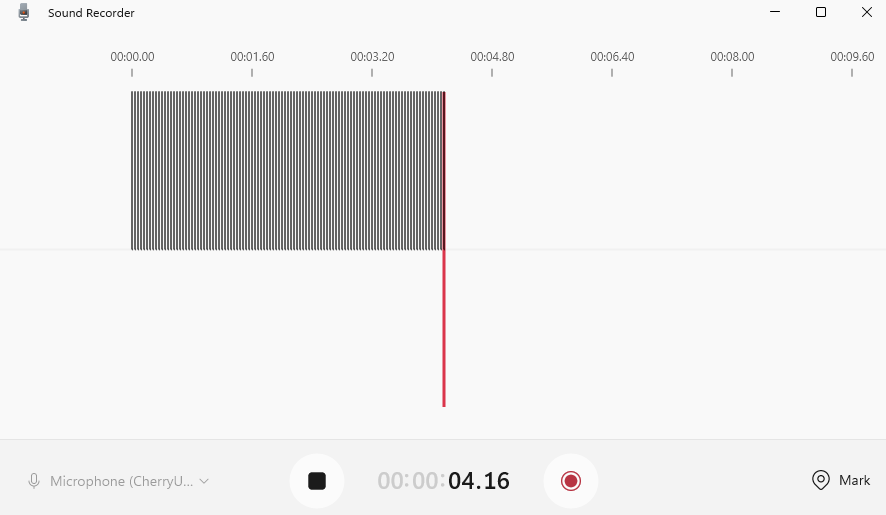
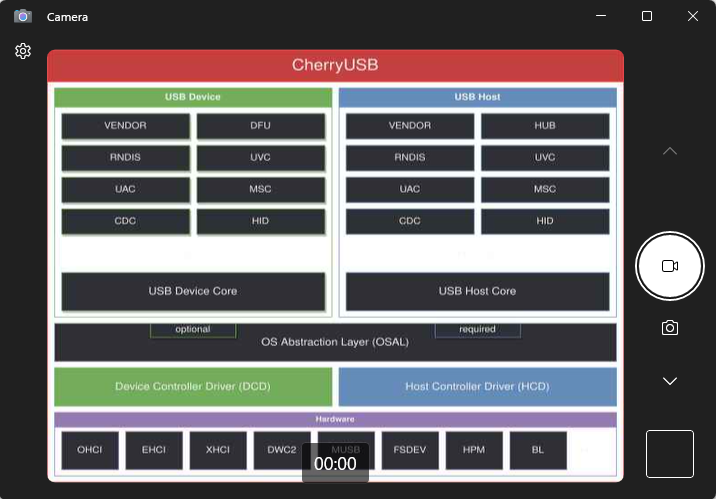

# CherryUSB CLI 示例

[English](README.md) | [中文](README_zh.md)

本示例通过 Shell 命令提供 CherryUSB Device 和 Host 功能演示。Device 模式支持 CDC ACM、CDC ECM、CDC RNDIS、HID、MSC、UAC 和 UVC；Host 模式支持 Serial（包括 CDC ACM）、CDC ECM、HID 和 MSC。

## 功能和 Shell 命令

### Device 模式

| 功能 | 启动命令 | 辅助命令 |
|:----|:---------|:---------|
| CDC ACM 虚拟串口和 Loopback | `usbd_cdc_acm_test` | `usbd_cdc_acm_stats` |
| CDC ECM 以太网桥接 | `usbd_cdc_ecm_test` | |
| CDC RNDIS 以太网桥接 | `usbd_cdc_rndis_test` | |
| HID 键盘 | `usbd_hid_keyboard_test` | `usbd_hid_keyboard_pause` |
| MSC RAM Disk | `usbd_msc_test` | |
| UAC 1.0 音频设备 | `usbd_uac_v1_test` | |
| UVC MJPEG 摄像头 | `usbd_uvc_mjpeg_test` | |
| CDC ACM + MSC 复合设备 | `usbd_cdc_acm_msc_test` | |

使用 `usbd_stop` 停止当前 Device 测试。同一时间只能运行一个 Device 测试。

### Host 模式

| 功能 | 枚举后的测试行为 |
|:----|:-----------------|
| CDC ACM | 自动执行双向吞吐量测试 |
| CDC ECM | 注册 lwIP 网络接口 |
| HID | 接收并打印 Input Report |
| MSC | 挂载设备并执行写、读和数据校验测试 |

使用 `usbh_start` 启动 Host 模式，使用 `lsusb` 查看已连接的 USB 设备，使用 `usbh_stop` 停止 Host 模式。Device 模式和 Host 模式互斥。

> **限制：** Host 模式中的 Serial、CDC ECM、HID 和 MSC 示例各自只支持一个活动实例。连接多个同类型设备，或同一设备提供多个同类型接口时，后续实例不会启动对应的示例功能。

## 支持的芯片

| 芯片 | 开发板 | 备注 |
|:----:|:------:|:-----|
| BL702 | `bl702dk` | 仅支持 Device 模式；由于 RAM 限制，不启用 MSC Device |
| BL616 | `bl616dk` | 支持 Device 和 Host 模式 |
| BL616CL | `bl616cldk` | 支持 Device 和 Host 模式 |
| BL618DG | `bl618dgdk` | AP Core；不启用 Device CDC ECM/RNDIS |

可用的 Shell 命令取决于所选芯片和工程配置。在开发板 Shell 中输入 `help`，可以查看当前固件包含的命令。

## 编译

- BL702

```
make CHIP=bl702 BOARD=bl702dk
```

- BL616

```
make CHIP=bl616 BOARD=bl616dk
```

- BL616CL

```
make CHIP=bl616cl BOARD=bl616cldk
```

- BL618DG AP Core

```
make CHIP=bl618dg BOARD=bl618dgdk CPU_ID=ap
```

## 烧录

```
make flash CHIP=chip_name COMX=xxx
```

将 `chip_name` 和 `xxx` 替换为目标芯片和串口名称。

## 测试准备

1. 将开发板调试串口连接到串口终端。
2. 编译并烧录示例，然后复位开发板。
3. 输入 `help`，确认当前固件支持的 USB 命令。
4. 根据测试要求，将开发板 USB 数据接口连接到 PC 或 USB 外设。
5. 切换 Device/Host 模式前，先停止当前运行的模式。

CDC ECM 和 RNDIS Device 测试还需要带 Ethernet PHY 的开发板和一根网线。

## USB Device 模式

### CDC ACM

**命令：** `usbd_cdc_acm_test`

**硬件：** Windows 或 Linux PC、USB 数据线

枚举成功后，PC 会生成一个虚拟串口。使用串口终端打开该端口并置位 DTR，即可进入 Loopback 模式；PC 发送的数据会从同一个虚拟串口返回。使用 `usbd_cdc_acm_stats` 查看传输统计，测试结束后使用 `usbd_stop` 停止。

开发板日志：

```
[I][ACM] Create USB device cdc_acm data send task...
[I][ACM] usbd cdc_acm machine start/restart
[I/USB] CDC_ACM USBD_EVENT_RESET
[I/USB] CDC_ACM configured done
[I][ACM] USBD ACM Ready!
[I][ACM] DTR set, Enter the loopback test mode
[I][ACM] DTR clear, Exit the loopback test mode
```

进入 Loopback 模式后的日志：

```
IACM DTR set, Enter the loopback test mode
```

Windows 设备管理器：

<div align="center">
    
</div>

Linux 枚举日志：

```
$ sudo dmesg -w
[ 2354.648190]usb 3-5:new high-speed USB device number 5 using xhci hcd
[ 2354.797016] usb 3-5: New USB device found, idVendor=ffff, idProduct=ffff, bcdDevice= 1.00
[ 2354.797024] usb 3-5: New USB device strings: Mfr=1, Product=2, SerialNumber=3
[ 2354.797027] usb 3-5: Product: CherryUSB_CDC_DEMO
[ 2354.797029] usb 3-5: Manufacturer: CherryUSB
[ 2354.797031] usb 3-5: SerialNumber: 2022123456
[ 2354.816798] cdc_acm 3-5:1.0: ttyACM0: USB ACM device
[ 2354.816822] usbcore: registered new interface driver cdc_acm
[ 2354.816825] cdc_acm: USB Abstract Control Model driver for USB modems and ISDN adapters
```

### CDC ECM

**命令：** `usbd_cdc_ecm_test`

**硬件：** Linux PC、支持 Ethernet 的开发板、USB 数据线、网线

该测试将 USB CDC ECM 网络接口桥接到开发板 EMAC。使用 `usbd_stop` 停止测试。

开发板日志：

```
[I][EPHY] eth phy scan success, phy_addr: 1, phy_id: 0x02430C54
[W][EPHY] drv_match falied, use General driver
[I][ECM] Create USB device cdc_ecm <-> emac task...
[I][ECM] USB device cdc_ecm <-> emac task start...
[I][ECM] usbd cdc_ecm machine start/restart
[W][ETH_EMAC] Eth Emac ReStart (LinkDown) !!!
[I/USB] CDC_ECM USBD_EVENT_CONFIGURED
[I][ECM] USBD ECM EMAC Ready!
[W][ETH_EMAC] Eth Emac LinkUp !!!
[I][ETH_EMAC] TX_BUF_CNT:0, RX_BUF_CNT:10
[I][ETH_EMAC] eth_phy speed: 100M_FULL_DUPLEX
[I][ECM] USBD ECM IN/RX start
[I][ECM] USBD ECM OUT/TX start

[I][ETH_EMAC] TX: success cnt:0, error cnt:0, total size:0Byte
[I][ETH_EMAC]     push_cnt:0, tx_db waiting:0, tx_bd_ptr:0
[I][ETH_EMAC] RX: success cnt:0, error cnt:0, total size:0Byte
[I][ETH_EMAC]     push_cnt:10, rx_db waiting:10, rx_bd_ptr:0, busy cnt:0
```

Linux 枚举日志和网络接口信息：

```
$ sudo dmesg -w
[664826.119339] usb 1-3: new high-speed USB device number 10 using xhci_hcd
[664826.514987] usb 1-3: New USB device found, idVendor=ffff, idProduct=ffff, bcdDevice= 1.00
[664826.514991] usb 1-3: New USB device strings: Mfr=1, Product=2, SerialNumber=3
[664826.514992] usb 1-3: Product: CherryUSB_CDC_ECM_DEMO
[664826.514993] usb 1-3: Manufacturer: CherryUSB
[664826.514994] usb 1-3: SerialNumber: 2022123456
[664826.558607] cdc_ether 1-3:1.0 eth0: register 'cdc_ether' at usb-0000:00:14.0-3, CDC Ethernet Device, 18:b9:05:12:34:56
[664826.558639] usbcore: registered new interface driver cdc_ether
[664826.565021] cdc_ether 1-3:1.0 enx18b905123456: renamed from eth0

$ ifconfig
enx18b905123456: flags=4163<UP,BROADCAST,RUNNING,MULTICAST>  mtu 1500
		inet 10.28.30.186  netmask 255.255.255.0  broadcast 10.28.30.255
		inet6 fe80::7b6e:119c:c26:e462  prefixlen 64  scopeid 0x20<link>
		ether 18:b9:05:12:34:56  txqueuelen 1000  (Ethernet)
		RX packets 2382  bytes 414519 (414.5 KB)
		RX errors 0  dropped 215  overruns 0  frame 0
		TX packets 208  bytes 30106 (30.1 KB)
		TX errors 0  dropped 0 overruns 0  carrier 0  collisions 0
```

### CDC RNDIS

**命令：** `usbd_cdc_rndis_test`

**硬件：** Windows PC、支持 Ethernet 的开发板、USB 数据线、网线

该测试将 Windows RNDIS 网络接口桥接到开发板 EMAC。使用 `usbd_stop` 停止测试。

开发板日志：

```
[I][EPHY] eth phy scan success, phy_addr: 1, phy_id: 0x02430C54
[W][EPHY] drv_match falied, use General driver
[I][RNDIS] Create USB device cdc_rndis <-> emac task...
[I][RNDIS] USB device cdc_rndis <-> emac task start...
[I][RNDIS] usbd rndis machine start/restart
[W][ETH_EMAC] Eth Emac ReStart (LinkDown) !!!
[I/USB] CDC_RNDIS USBD_EVENT_CONFIGURED
[I][RNDIS] USBD RNDIS EMAC Ready!
[W][ETH_EMAC] Eth Emac LinkUp !!!
[I][ETH_EMAC] TX_BUF_CNT:0, RX_BUF_CNT:10
[I][ETH_EMAC] eth_phy speed: 100M_FULL_DUPLEX
[I][RNDIS] USBD RNDIS IN/RX start
[I][RNDIS] USBD RNDIS OUT/TX start
[I][ETH_EMAC] TX: success cnt:0, error cnt:0, total size:0Byte
[I][ETH_EMAC]     push_cnt:0, tx_db waiting:0, tx_bd_ptr:0
[I][ETH_EMAC] RX: success cnt:0, error cnt:0, total size:0Byte
[I][ETH_EMAC]     push_cnt:10, rx_db waiting:10, rx_bd_ptr:0, busy cnt:0

[I][ETH_EMAC] TX: success cnt:0, error cnt:0, total size:0Byte
[I][ETH_EMAC]     push_cnt:0, tx_db waiting:0, tx_bd_ptr:0
[I][ETH_EMAC] RX: success cnt:0, error cnt:0, total size:0Byte
[I][ETH_EMAC]     push_cnt:10, rx_db waiting:10, rx_bd_ptr:0, busy cnt:0
```

Windows 网络设置：

<div align="center">
    
</div>

### HID 键盘

**命令：** `usbd_hid_keyboard_test`

**硬件：** Windows 或 Linux PC、USB 数据线

设备会持续发送键盘 Report，测试前请选中合适的输入区域。使用 `usbd_hid_keyboard_pause` 暂停或恢复 Report 发送，使用 `usbd_stop` 停止测试。

开发板日志：

```
[I][USBD_CLI] Create USB device usbd_hid_keyboard task...
[I][USBD_CLI] usbd_hid_keyboard_task run
[I][USBD_CLI] hid_keyboard_init done
[I/USB] HID KeyBoard configured done
```

### MSC

**命令：** `usbd_msc_test`

**硬件：** Windows 或 Linux PC、USB 数据线

枚举成功后，PC 会识别到一个虚拟存储设备。使用 `usbd_stop` 停止测试。BL702 不启用此命令。

开发板日志：

```
[I/USB] MSC configured done
```

### UAC 1.0

**命令：** `usbd_uac_v1_test`

**硬件：** Windows PC、USB 数据线

枚举成功后，打开音频应用并选择该 USB 音频设备。使用 `usbd_stop` 停止测试。

开发板日志：

```
[I][USBD_CLI] Create USB device usbd_uac_v1 task...
[I][USBD_CLI] usbd_uac_v1_task run
[I][USBD_CLI] uac_v1_init done
[I/USB] UAC configured done
[I/USB] UAC OPEN SPK
```

Windows 音频设备：

<div align="center">
    
</div>

### UVC MJPEG

**命令：** `usbd_uvc_mjpeg_test`

**硬件：** Windows PC、USB 数据线

枚举成功后，打开 Windows 相机应用并选择该 USB 摄像头。使用 `usbd_stop` 停止测试。

开发板日志：

```
[I][USBD_CLI] Create USB device usbd_uvc_mjpeg task...
[I][USBD_CLI] usbd_uvc_mjpeg_task run
[I][USBD_CLI] uvc_mjpeg_init done
[I/USB] UVC configured done
[I/USB] UVC OPEN
```

Windows 相机应用：

<div align="center">
    
</div>

### CDC ACM + MSC 复合设备

**命令：** `usbd_cdc_acm_msc_test`

**硬件：** Windows 或 Linux PC、USB 数据线

PC 会同时识别到虚拟串口和虚拟存储设备。使用 `usbd_stop` 停止测试。BL702 不启用此命令。

开发板日志：

```
[I][ACM_MSC] Create USB device cdc_acm data send task...
[I][ACM] usbd cdc_acm machine start/restart
[I/USB] MSC CDC_ACM configured done
[I][ACM] USBD ACM Ready!
[I][ACM] DTR set, Enter the loopback test mode
[I][ACM] DTR clear, Exit the loopback test mode
```

## USB Host 模式

连接 USB 外设前执行 `usbh_start`。枚举成功后，对应的 Class 测试会自动启动。使用 `lsusb` 查看枚举设备，测试结束后执行 `usbh_stop`。

### CDC ECM Host

**硬件：** CDC ECM 设备、USB 数据线

Host 会打印设备 MAC 地址和最大报文段长度，注册网络设备并创建 lwIP 网络接口。

```
[I/usbh_hub] New high-speed device on Bus 0, Hub 1, Port 1 connected
[I/usbh_core] New device found,idVendor:ffff,idProduct:ffff,bcdDevice:0100
[I/usbh_core] The device has 1 bNumConfigurations
[I/usbh_core] The device has 2 interfaces
[I/usbh_core] Enumeration success, start loading class driver
[I/usbh_core] Loading cdc_ecm class driver
[I/usbh_cdc_ecm] CDC ECM MAC address 18:b9:05:12:34:56
[I/usbh_cdc_ecm] CDC ECM Max Segment Size:1514
[I/usbh_cdc_ecm] Ep=83 Attr=03 Mps=16 Interval=05 Mult=00
[I/usbh_cdc_ecm] Ep=02 Attr=02 Mps=512 Interval=00 Mult=00
[I/usbh_cdc_ecm] Ep=81 Attr=02 Mps=512 Interval=00 Mult=00
[I/usbh_cdc_ecm] Set CDC ECM packet filter:000c
[I/usbh_cdc_ecm] Register CDC ECM Class:/dev/cdc_ether
[I/USB] USBH CDC ECM run
USBH CDC ECM LWIP test start
[I/usbh_core] Loading cdc_data class driver
[I/USB] CDC ECM link down
```

### MSC Host

**硬件：** USB 存储设备、USB 数据线

枚举成功后，示例会对连接的存储设备执行写、读和数据校验测试。

> **警告：** 该测试会向连接的存储设备写入数据，运行前请备份重要数据。

```
[I/USB] New high-speed device on Hub 2, Port 1 connected
[I/USB] New device found,idVendor:04e8,idProduct:61fd,bcdDevice:0005
[I/USB] The device has 1 interfaces
[I/USB] Enumeration success, start loading class driver
[I/USB] Loading msc class driver
[I/USB] Get max LUN:1
[I/USB] Ep=81 Attr=02 Mps=512 Interval=00 Mult=00
[I/USB] Ep=02 Attr=02 Mps=512 Interval=00 Mult=00
[E/USB] csw bStatus 1
[I/USB] Capacity info:
[I/USB] Block num:15486976,block size:512
[I/USB] Register MSC Class:/dev/sda

[I/USB] ******************** be about to write test... **********************
[I/USB] Write Test Succeed!
[I/USB] Single data size:32768 Byte, Write the number:1024, Total size:32768 KB
[I/USB] Time:1766ms, Write Speed:18554 KB/s

[I/USB] ******************** be about to read test... **********************
[I/USB] Read Test Succeed!
[I/USB] Single data size:32768Byte, Read the number:1024, Total size:32768 KB
[I/USB] Time:1496ms, Read Speed:21903 KB/s

[I/USB] ******************** be about to check test... **********************
[I/USB] Check Test Succeed!
[I/USB] All Data Is Good!
```

### Serial Host（CDC ACM）

**硬件：** CDC ACM 设备、USB 数据线

枚举成功后，CDC ACM 设备会注册为统一的 Serial Class 实例。示例通过
`usbh_serial_open`打开设备，通过 `USBH_SERIAL_CMD_TIOCMSET`置位 DTR，并在测试
结束后通过 `usbh_serial_close`关闭设备。该测试有意不调用
`USBH_SERIAL_CMD_SET_ATTR`：该命令会启动由 Serial Class 管理的 RingBuffer 接收，
而 Serial CDC 原始异步接口要求 `dwDTERate == 0`，并由测试直接同时保持一路
TX URB 和一路 RX URB，以执行双向并行吞吐量测试。

```
[I/usbh_hub] New high-speed device on Bus 0, Hub 1, Port 1 connected
[I/usbh_core] New device found,idVendor:ffff,idProduct:ffff,bcdDevice:0100
[I/usbh_core] The device has 1 bNumConfigurations
[I/usbh_core] The device has 2 interfaces
[I/usbh_core] Enumeration success, start loading class driver
[I/usbh_core] Loading cdc_acm class driver
[I/usbh_cdc_acm] Ep=04 Attr=02 Mps=512 Interval=00 Mult=00
[I/usbh_cdc_acm] Ep=83 Attr=02 Mps=512 Interval=00 Mult=00
[I/usbh_serial] Register Serial Class: /dev/ttyACM0 (cdc_acm)
USBH serial speed test start
[I/usbh_core] Loading cdc_data class driver
USBH serial test time: 2000
USBH serial tx size: 23160832
USBH serial rx size: 23160907
USBH serial tx speed: 11309 KB/S
USBH serial rx speed: 11309 KB/S
USBH serial total speed: 22618 KB/S
USBH serial speed test end
```

### HID Host

**硬件：** USB 鼠标或键盘、USB 数据线

枚举成功后，设备会注册为输入设备，示例开始接收 HID Input Report。

```
[I/usbh_hub] New low-speed device on Bus 0, Hub 1, Port 1 connected
[I/usbh_core] New device found,idVendor:413c,idProduct:2113,bcdDevice:0110
[I/usbh_core] The device has 1 bNumConfigurations
[I/usbh_core] The device has 2 interfaces
[I/usbh_core] Enumeration success, start loading class driver
[I/usbh_core] Loading hid class driver
[I/usbh_hid] Ep=81 Attr=03 Mps=8 Interval=10 Mult=00
[I/usbh_hid] Register HID Class:/dev/input0
USBH HID test start, hid_interval: 10ms
[I/usbh_core] Loading hid class driver
[W/usbh_hid] Do not support set idle
[I/usbh_hid] Ep=82 Attr=03 Mps=3 Interval=10 Mult=00
[I/usbh_hid] Register HID Class:/dev/input1
[E/USB] USBH HID test already running
USBH HID test end
```
